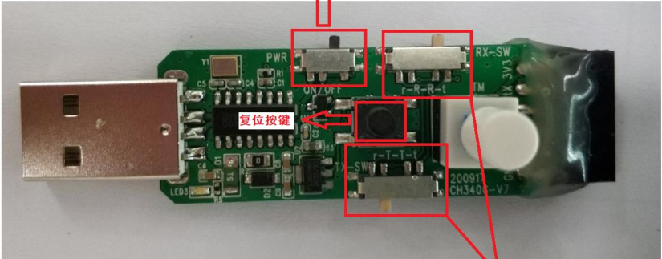
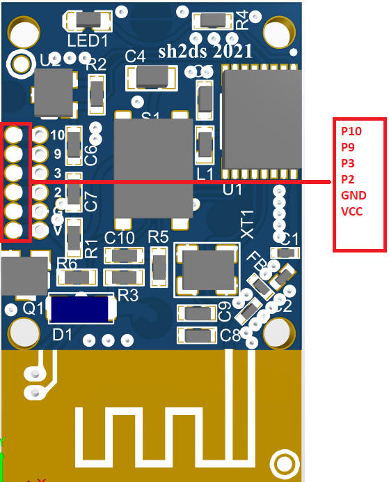
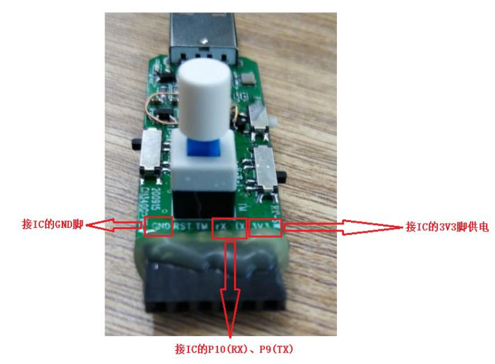
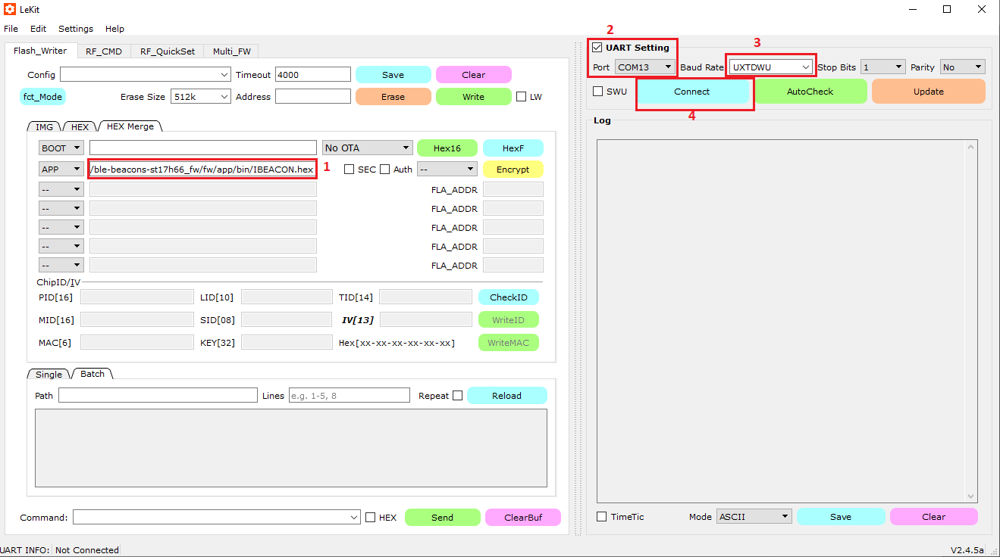
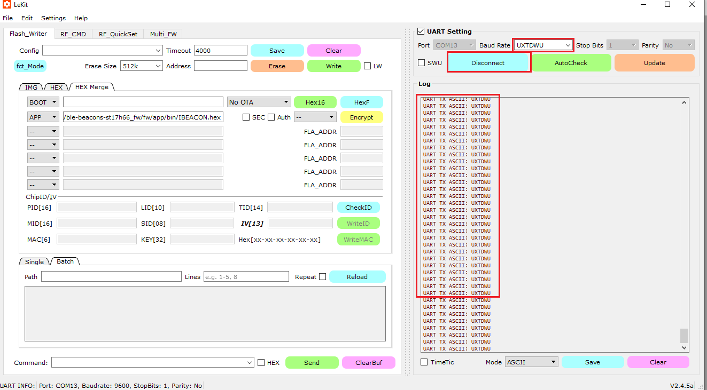
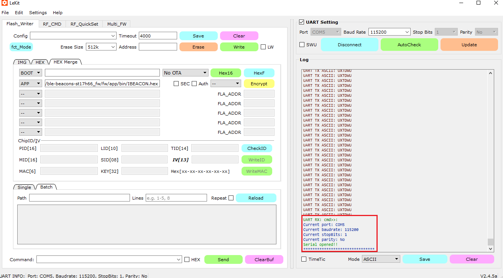
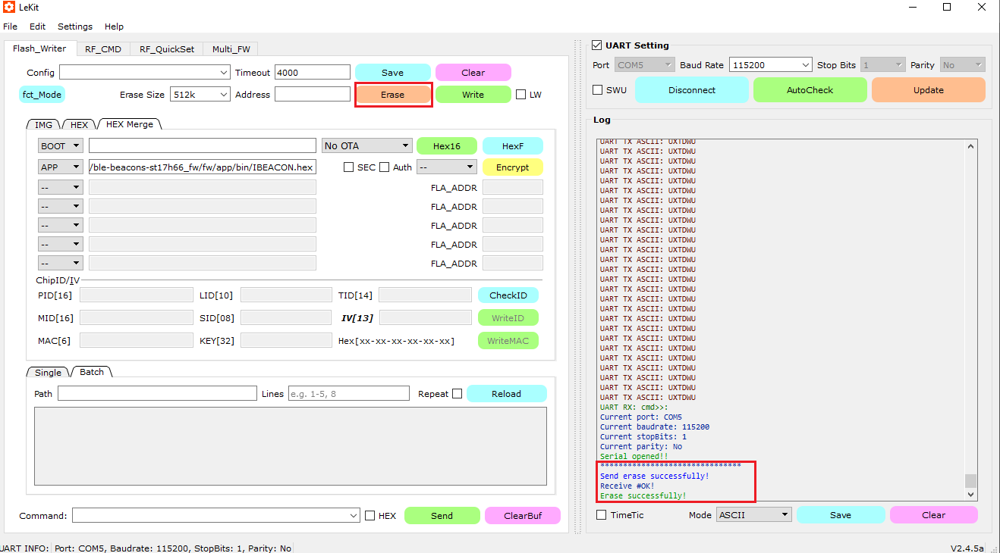
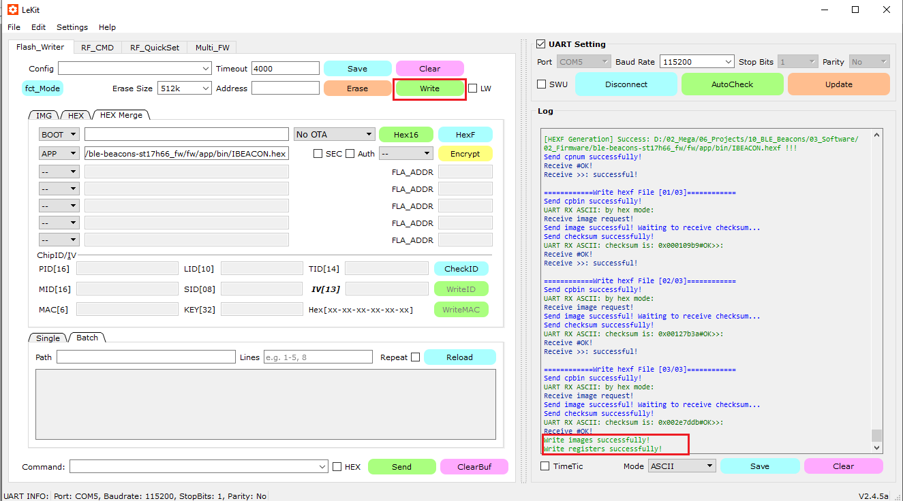
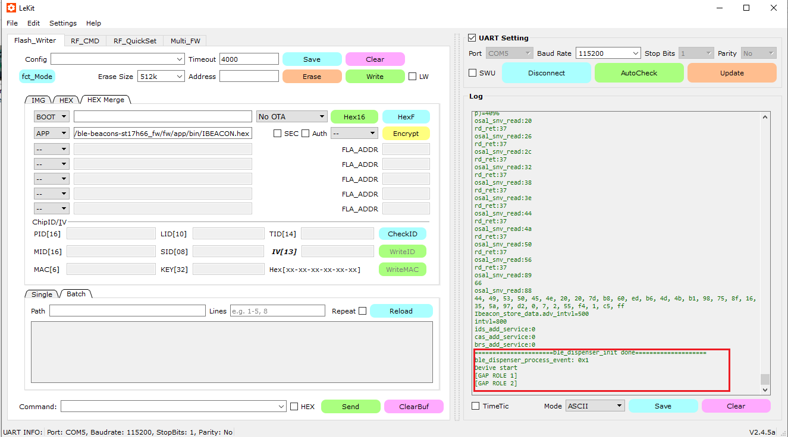

# BLE Beacons ST17H66

## I. Programing steps

### 1. Programer tool set up as picture

### 2. Connect board to the programer tool
| Board      | Programer Tool |
|------------|-------------   |
| VCC        | VCC            |
| GND        | GND            |
| RX         | P10            |
| TX         | P09            |

| Board      | Programer Tool |
|------------|-------------   |
|   |  |

### 3. Open the tool as link \ble-beacons-st17h66_fw\documents\01_Tool\Lekit_200927.exe
#### + Select the firmware as link: \ble-beacons-st17h66_fw\fw\app\bin\IBEACON.hex
#### + Connect to the hardware COM port

### 4. After connect to the Programer hardare tool

### 5. Press the reset button on the hardware tool then:

### 6. Erase the chip successfully

### 7. Plashing the chip successfully

### 8. Press reset button the device can run

